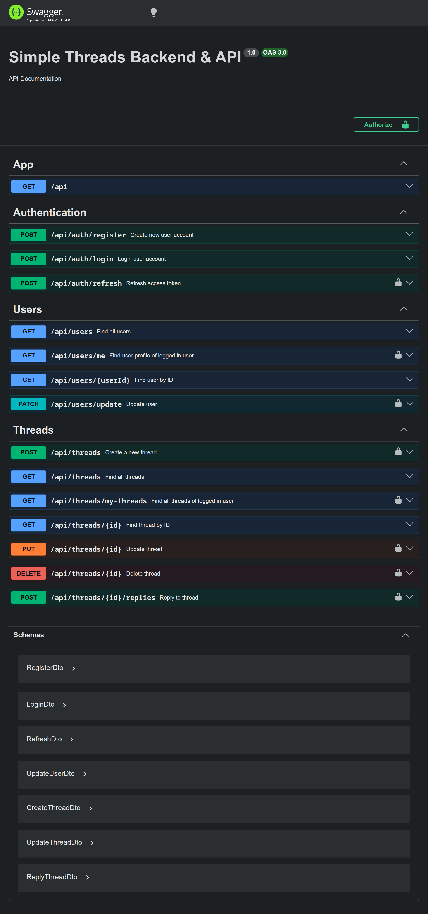

> Code Challenge Milestone 1

<h1 align="center">Discussion Threads Backend Service</h1>
<p align="center">Simple Backend service for Discussion Threads Platform, built with NestJS, SQLite, and PrismaORM</p>

<details>
<summary>See Swagger Screenshot</summary>



</details>

## 🚀 Tech Stack

- **Framework:** NestJS
- **Database:**
  - SQLite
  - PrismaORM
- **Authentication:**
  - passport-jwt
  - bcryptjs
- **API Documentation:** Swagger

## 💡 Features

**1. User & Authentication:**

- `bcrypt` for password hashing (no plain text password).
- `accessToken` and `refreshToken` for user access key.
- Role-Based Access Control (user only can access permitted data).

**2. Threads & Replies:**

- User can access all `threads` or `my-threads`.
- User can reply and see replies from thread.
- User can edit or delete their own threads.

**3. Server**

- Rate limiter.
- Swagger documentation.

## 📍 Endpoints

**Auth:**

|  Method  | Endpoint             | Description             | Auth |
| :------: | -------------------- | ----------------------- | :--: |
| **POST** | `/api/auth/register` | Create new user account |  ❌  |
| **POST** | `/api/auth/login`    | Login user account      |  ❌  |
| **POST** | `/api/auth/refresh`  | Refresh access token    |  ✅  |

**User:**

|  Method   | Endpoint              | Description                         | Auth |
| :-------: | --------------------- | ----------------------------------- | :--: |
|  **GET**  | `/api/users`          | Find all users                      |  ❌  |
|  **GET**  | `/api/users/me`       | Find user profile of logged in user |  ❌  |
|  **GET**  | `/api/users/{userId}` | Find user by ID                     |  ❌  |
| **PATCH** | `/api/users/update`   | Update user                         |  🔒  |

**Threads:**

|   Method   | Endpoint                    | Description                        | Auth |
| :--------: | --------------------------- | ---------------------------------- | :--: |
|  **POST**  | `/api/threads`              | Create a new thread                |  🔒  |
|  **GET**   | `/api/threads`              | Find all threads                   |  ❌  |
|  **GET**   | `/api/threads/my-threads`   | Find all threads of logged in user |  🔒  |
|  **GET**   | `/api/threads/{id}`         | Find thread by ID                  |  ❌  |
|  **PUT**   | `/api/threads/{id}`         | Update thread                      |  🔒  |
| **DELETE** | `/api/threads/{id}`         | Delete thread                      |  🔒  |
|  **POST**  | `/api/threads/{id}/replies` | Reply to thread                    |  🔒  |

## 📦 Deployment

Before starting, make sure to install:

- Git
- Node.js
- NPM (included when installing Node.js)

### How To Run Locally

**1. Clone Repository.**
Clone project from remote repository to local folder.

```bash
# Clone repo from Github
git clone https://github.com/ahmadrka/code-challenge-milestone-2.git

# Point to clone directory
cd code-challenge-milestone-2
```

**2. Install dependencies.**
Run this script to install required project dependencies.

```bash
npm install
```

**3. Set Up Dotenv File.**
Copy dotenv template.

```bash
# Copy The Reference Env File
cp .env.example .env
```

Open `.env` and set your own variables.

**4. Migrate Database Schema.**
Run this script to migrate database schema into SQLite database.
_Note: Change database connection string in dotenv file._

```bash
npx prisma migrate dev
```

**5. Run Development Server.**

```bash
npm run start:dev
```

**4. Open [localhost:3000](http://localhost:3000/) in your browser.**
_Note: Change port number with port number in dotenv file._

**5. Congratulation, You're Running This Backend Service.**

### How To Run In Production

### How To Run Locally

**1. Clone Repository.**
Clone project from remote repository to local folder.

```bash
# Clone repo from Github
git clone https://github.com/ahmadrka/code-challenge-milestone-2.git

# Point to clone directory
cd code-challenge-milestone-2
```

**2. Install dependencies.**
Run this script to install required project dependencies.

```bash
npm install
```

**3. Set Up Dotenv File.**
Copy dotenv template.

```bash
# Copy The Reference Env File
cp .env.example .env
```

Open `.env` and set your own variables.

> [!WARNING]
> Never use the default key in production, as it allows users to compromise server security system.

**4. Migrate Database Schema.**
Run this script to migrate pending migration into production SQLite database.
_Note: Change database connection string in dotenv file._

```bash
npx prisma migrate deploy
```

**5. Build And Run Production Server.**

```bash
# Build Project
npm run build

# Run Production Server
npm run start:prod
```

**4. Open [localhost:3000](http://localhost:3000/) in your browser.**
_Note: Change port number with port number in dotenv file._

**5. Congratulation, You're Running This Backend Service.**
